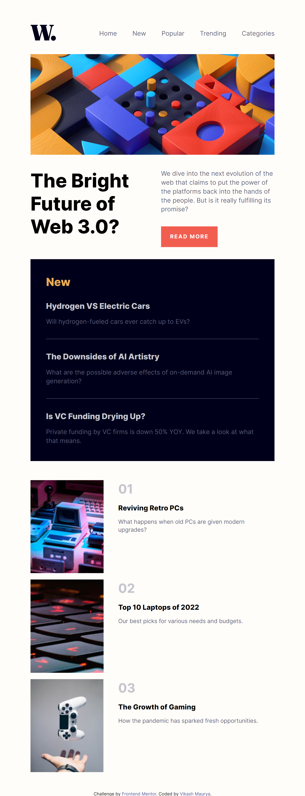
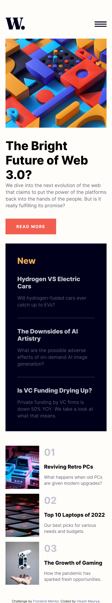

# Frontend Mentor - News homepage solution

This is a solution to the [News homepage challenge on Frontend Mentor](https://www.frontendmentor.io/challenges/news-homepage-H6SWTa1MFl).

## Table of contents

- [Overview](#overview)
  - [The challenge](#the-challenge)
  - [Screenshot](#screenshot)
  - [Links](#links)
- [My process](#my-process)
  - [Built with](#built-with)
  - [What I learned](#what-i-learned)
  - [Useful resources](#useful-resources)
- [Author](#author)

## Overview

### The challenge

Users should be able to:

- View the optimal layout for the interface depending on their device's screen size
- See hover and focus states for all interactive elements on the page

### Screenshot

| Dexktop view                                     | Tablet view                                   | mobile view                                    |
| ------------------------------------------------ | --------------------------------------------- | ---------------------------------------------- |
| ![desktop [preview]](./assets/images/laptop.png) |  |  |

### Links

- Solution URL: [get solution🌐](https://github.com/VikashMaurya10/news-homepage-main)
- Live Site URL: [view🌐](https://vikashmaurya10.github.io/news-homepage-main/)

## My process

### Built with

- Semantic HTML5 markup
- SCSS custom properties
- Flexbox
- CSS Grid
- Mobile-first workflow

### What I learned

- I'm using first time <ins>**Grid Css**</ins> properties to create responsive design & I'm glad to use these css properties. I realised in comparision to <ins>**Flex properties**</ins> , <ins>**Grid Css**</ins> is more useful to create responsive design.
- During completion of this project I learned little bit Grid properties but I'd recommend it to anyone still learning this concept.
  To see how you can add code snippets, see below:

```css
.proud-of-this-css {
  display: grid;
  gap: 1rem;
  grid-template-columns: repeat(auto-fit, minmax(300px, 1fr));
}
```
> This code use to create responsive <ins>**Grid columns**</ins>. If any column has lessthen width <ins>**300px**</ins> then that column is auto shifted in another row.

### Useful resources

- [Figma](https://www.figma.com) - This helped me for measuring the actual design. I really liked this pattern and will use it going forward.

## Author

- website - [@vikashmaurya](https://github.com/VikashMaurya10/VikashMaurya10)
- Frontend Mentor - [@vikashmaurya](https://www.frontendmentor.io/profile/VikashMaurya10)
- LinkedIn - [@in-vikashmaurya](https://www.linkedin.com/in/in-vikashmaurya)
